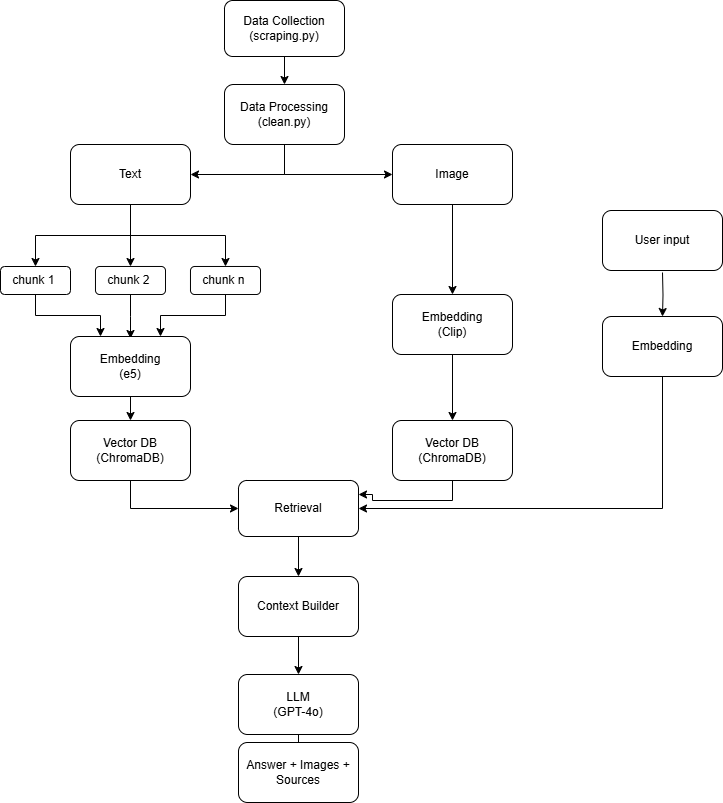

# Multimodal RAG System for The Batch Newsletter

This project implements a Retrieval-Augmented Generation (RAG) system that combines text and image search capabilities for The Batch newsletter archives. The system uses advanced language models and embeddings to provide accurate, context-aware responses to user queries.

## System Architecture



The diagram above illustrates the flow of data through the system


## Features

- **Multimodal Search**: Combines text and image search capabilities
- **Advanced Embeddings**: Uses E5-base-v2 for text and OpenCLIP for images
- **Interactive UI**: Gradio-based web interface for easy interaction
- **Context-Aware Responses**: Provides answers based on relevant text and image context

## Technical Stack

- **Language Models**: GPT-4о for response generation
- **Text Embeddings**: E5-base-v2 (intfloat/e5-base-v2)
- **Image Embeddings**: OpenCLIP (ViT-B-32)
- **Vector Store**: ChromaDB
- **Web Interface**: Gradio
- **Framework**: LangChain

## Prerequisites

- CUDA-capable GPU (recommended)
- OpenAI API key

## Installation

1. Clone the repository:
```bash
git clone [repository-url]
cd [repository-name]
```

2. Create and activate a virtual environment (recommended):
```bash
python -m venv venv
source venv/bin/activate  # On Windows: venv\Scripts\activate
```

3. Install dependencies:
```bash
pip install -r requirements.txt
```

4. Create a `.env` file in the project root with your OpenAI API key:
```
OPENAI_API_KEY=your_api_key_here
```

## Project Structure

```
.
├── assets/           # Project assets (images, diagrams)
│   └── architecture.png  # System architecture diagram
├── data/
│    └── image/      # Cleaned data from clean.py   
├── demo/            # Video demo
├── issues/          # Raw newsletter content (images and JSON data)
├── index/           # Vector store directory
│   ├── text/        # Text embeddings
│   └── image/       # Image embeddings
├── scraping.py      # Scrapes The Batch newsletter content
├── clean.py         # Cleans and processes scraped data
├── build_vectors.py  # Creates vector embeddings for text and images
├── ask.py           # Main application with RAG implementation
├── requirements.txt # Project dependencies
└── .env            # Environment variables
```

## Setup and Usage

The system requires a specific sequence of steps to set up and run:

1. **Data Collection**:
```bash
python scraping.py
```
This script scrapes The Batch newsletter content and saves it locally.

2. **Data Cleaning**:
```bash
python clean.py
```
This script processes and cleans the scraped data, preparing it for embedding generation.

3. **Vector Store Creation**:
```bash
python build_vectors.py
```
This script generates embeddings for both text and images, creating the vector store.

4. **Running the Application**:
```bash
python ask.py
```
This starts the Gradio web interface where you can interact with the system.

5. Open your web browser and navigate to the URL shown in the terminal

6. Enter your question in the text box and click "Search"

## System Architecture

1. **Data Pipeline**:
   - `scraping.py`: Collects raw data from The Batch newsletter
   - `clean.py`: Processes and structures the data
   - `build_vectors.py`: Creates embeddings and builds the vector store

2. **RAG Implementation** (`ask.py`):
   - **Query Processing**: Processes user queries for both text and image search
   - **Context Retrieval**:
     - Text search using E5-base-v2 embeddings
     - Image search using OpenCLIP
     - Results deduplication and ranking
   - **Response Generation**:
     - Combines retrieved context
     - GPT-4 generates responses
     - Includes source citations

## Model Selection Rationale

- **E5-base-v2**: Selected for its strong performance in text similarity tasks and efficient inference
- **OpenCLIP**: Chosen for its ability to understand both images and text in a unified embedding space
- **GPT-4**: Used for its superior reasoning capabilities and ability to synthesize information from multiple sources

## Performance Considerations

- The system uses CUDA acceleration when available
- Text chunks are limited to 4 most relevant results
- Image results are limited to 2 most relevant matches
- Response length is capped at 200 words for conciseness


